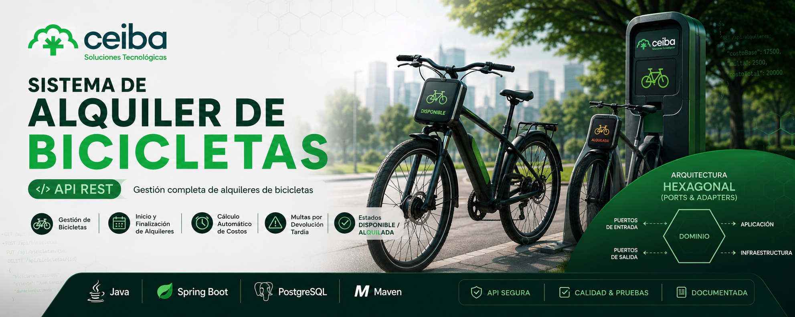

<p align="center">
  
</p>

# 🚲 API REST - Sistema de Alquiler de Bicicletas

API REST desarrollada con **Spring Boot** para la gestión del alquiler de bicicletas, permitiendo administrar bicicletas, iniciar y finalizar alquileres, calcular costos y multas, e implementar reglas de negocio mediante una arquitectura limpia y desacoplada.

---

# 📑 Índice

- [Descripción](#-descripción)
- [Tecnologías utilizadas](#-tecnologías-utilizadas)
- [Arquitectura](#-arquitectura)
- [Requisitos previos](#-requisitos-previos)
- [Ejecución del proyecto](#-ejecución-del-proyecto)
- [Endpoints principales](#-endpoints-principales)
- [Ejemplos de peticiones](#-ejemplos-de-peticiones)
- [Pruebas automatizadas](#-pruebas-automatizadas)

---

# 📖 Descripción

La aplicación permite administrar el proceso de alquiler de bicicletas mediante operaciones sobre bicicletas y alquileres.

Entre las funcionalidades implementadas se encuentran:

- Registro de bicicletas.
- Consulta de bicicletas.
- Cambio de estado de bicicletas.
- Inicio de alquiler.
- Finalización de alquiler.
- Cálculo automático del costo del alquiler.
- Cálculo de multas por retraso.
- Validaciones de reglas de negocio.

---

# 🛠 Tecnologías utilizadas

- Java 17
- Spring Boot 3.5.11
- Spring Web
- Spring Data JPA
- H2 Database
- Maven
- JUnit 5
- Mockito

---

# 🏛 Arquitectura

El proyecto fue desarrollado utilizando **Arquitectura Hexagonal (Ports & Adapters)**.

## Estructura

```
Domain
│
├── Model
├── Ports
│   ├── In
│   └── Out
└── Exception

Application
│
└── Services

Infrastructure
│
├── Adapter
│   ├── In
│   └── Out
└── Configuration
```

## Justificación

Se eligió Arquitectura Hexagonal porque permite:

- Separar la lógica de negocio de la infraestructura.
- Reducir el acoplamiento entre capas.
- Facilitar el mantenimiento del código.
- Mejorar la escalabilidad del proyecto.
- Permitir pruebas unitarias independientes de la base de datos y del framework.

La lógica del negocio permanece completamente aislada de Spring Boot y de la persistencia.

---

# ✅ Requisitos previos

Tener instalado:

- Java 17 o superior
- Maven 3.9+
- Git

Verificar instalación:

```bash
java -version

mvn -version
```

---

# ▶ Ejecución del proyecto

## 1. Clonar el repositorio

```bash
git clone <https://github.com/juanEsteban304/prueba-tecnica-alquiler-de-bicicletas-api.git>
```

## 2. Entrar al proyecto

```bash
cd alquilerbicicletas
```

## 3. Compilar

```bash
mvn clean install
```

## 4. Ejecutar la aplicación

```bash
mvn spring-boot:run
```

o desde el IDE ejecutando:

```
AlquilerbicicletasApplication.java
```

La aplicación quedará disponible en:

```
http://localhost:8080
```

---

# 🌐 Documentación de la API

OpenAPI:

```
http://localhost:8080/api/bicicletas
```

---

# 📌 Endpoints principales

## Bicicletas

| Método | Endpoint | Descripción |
|---------|----------|-------------|
| POST | /bicicletas | Registrar bicicleta |
| GET | /bicicletas | Listar bicicletas |
| GET | /bicicletas/buscar | Buscar bicicletas |
| PATCH | /bicicletas/{codigo}/estado | Cambiar estado |

---

## Alquileres

| Método | Endpoint | Descripción |
|---------|----------|-------------|
| POST | /alquileres | Iniciar alquiler |
| PATCH | /alquileres/{codigo}/finalizar | Finalizar alquiler |

---

# 📨 Ejemplos de peticiones

## Registrar bicicleta

```bash
curl -X POST http://localhost:8080/bicicletas \
-H "Content-Type: application/json" \
-d '{
    "tipo":"URBANA"
}'
```

---

## Consultar bicicletas

```bash
curl http://localhost:8080/bicicletas
```

---

## Buscar bicicletas

```bash
curl "http://localhost:8080/bicicletas/buscar?estado=DISPONIBLE&tipo=URBANA"
```

---

## Cambiar estado

```bash
curl -X PATCH http://localhost:8080/bicicletas/BIC-001/estado \
-H "Content-Type: application/json" \
-d '"EN_MANTENIMIENTO"'
```

---

## Iniciar alquiler

```bash
curl -X POST http://localhost:8080/alquileres \
-H "Content-Type: application/json" \
-d '{
    "codigoBicicleta":"BIC-001",
    "nombreCliente":"Juan Garcia",
    "duracionEstimada":2
}'
```

---

## Finalizar alquiler

```bash
curl -X PATCH http://localhost:8080/alquileres/BIC-001/finalizar
```

---

# ✅ Pruebas automatizadas

El proyecto cuenta con pruebas unitarias para validar las principales reglas de negocio:

- Registro de bicicletas.
- Consulta de bicicletas.
- Validación de códigos únicos.
- Cambio de estado de bicicletas.
- Inicio de alquiler.
- Finalización de alquiler.
- Cálculo del costo del alquiler.
- Cálculo de multas por retraso.
- Validación de estados permitidos.

Ejecutar todas las pruebas:

```bash
mvn test
```

---

# 👨‍💻 Autor

**Juan Esteban García Castro**

Prueba Técnica - API REST Sistema de Alquiler de Bicicletas